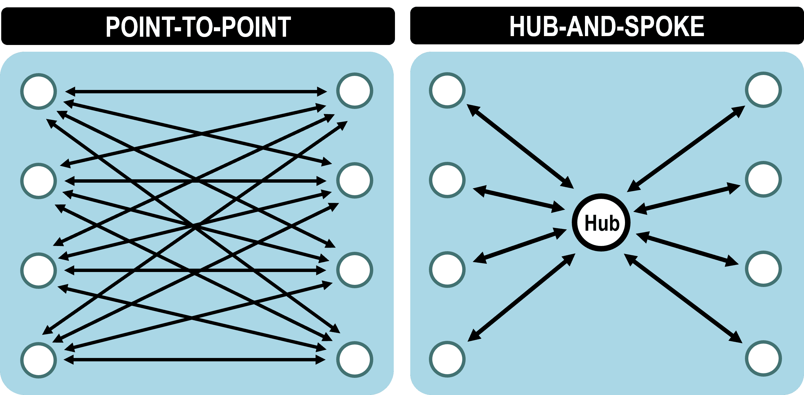

# Notities Computer Networks

## Protocollen

### 1. **TCP/IP (Transmission Control Protocol / Internet Protocol)**
   - Basisprotocol van het internet.
   - TCP zorgt voor betrouwbare, geordende en foutvrije datatransmissie.
   - IP zorgt voor adressering en routering van pakketten.

### 2. **UDP (User Datagram Protocol)**
   - Sneller maar onbetrouwbaar alternatief voor TCP.
   - Gebruikt bij streaming, gaming en VoIP.

### 3. **HTTP/HTTPS (Hypertext Transfer Protocol / Secure)**
   - Protocol voor het ophalen van webpagina's.
   - HTTPS voegt encryptie toe via TLS/SSL.

### 4. **FTP (File Transfer Protocol)**
   - Bestandsuitwisseling tussen computers.
   - Ondersteunt authenticatie en meerdere modi (actief/passief).

### 5. **DNS (Domain Name System)**
   - Vertaalt domeinnamen naar IP-adressen.
   - Gedistribueerd systeem met caching voor snelle toegang.

### 6. **SMTP, IMAP, POP3 (E-mailprotocollen)**
   - **SMTP (Simple Mail Transfer Protocol)**: Verzenden van e-mails.
   - **IMAP (Internet Message Access Protocol)**: Synchronisatie van e-mails op meerdere apparaten.
   - **POP3 (Post Office Protocol 3)**: Ophalen van e-mails naar één apparaat.

### 7. **DHCP (Dynamic Host Configuration Protocol)**
   - Wijs dynamisch IP-adressen toe aan apparaten in een netwerk.

### 8. **ICMP (Internet Control Message Protocol)**
   - Gebruikt voor netwerkdiagnostiek (bv. met `ping`).

### 9. **SSH (Secure Shell)**
   - Beveiligde toegang tot externe computers.

### 10. **SNMP (Simple Network Management Protocol)**
   - Monitoren en beheren van netwerkapparaten.

### 11. **BGP (Border Gateway Protocol)**
   - Regelt routering tussen autonome systemen op het internet.

### 12. **NTP (Network Time Protocol)**
   - Synchroniseert de tijd over netwerken.

Deze protocollen vormen de basis van computernetwerken en internetcommunicatie.

## Data link layer

 
 - Zorgt voor communicatie tussen end-device network interface cards.

-  Heeft 2 sublagen logical link control (llc) en media acces conntrol(mac)

- llc communiceert

- ARP bepaalt mac adress

<<<<<<< HEAD
- network interface card doet aan frame filtering om frames die niet voor jou bestemd zijn te filteren om alleen de frames die jij wilt te houden aan de hand van mac adress
=======
-**network interface card** doet aan **frame filtering** om frames die niet voor jou bestemd zijn te filteren om alleen de frames die jij wilt te houden aan de hand van **mac adress** .
>>>>>>> 56d160a (testtest)

### Waarom op n.i.c en niet op processor? 
- om onnodige belasting te voorkomen
- lagere latency
- extra security
### Conclusie
Frame filtering wordt op de NIC uitgevoerd omdat het sneller, efficiënter en minder belastend is voor de CPU. Hierdoor blijft de processor vrij voor andere taken, zoals applicatie-uitvoering en besturingssysteemprocessen.

# Netwerktopologieën 🌐  

Een **netwerktopologie** beschrijft hoe apparaten fysiek en logisch met elkaar verbonden zijn. Dit kan worden onderverdeeld in **LAN- (Local Area Network), WAN- (Wide Area Network) en fysieke topologieën**.  

---

# Wat is fysieke topologie?  
De **fysieke topologie** van een netwerk beschrijft **hoe apparaten fysiek met elkaar verbonden zijn** via kabels, switches, routers en andere netwerkhardware. Dit is anders dan de **logische topologie**, die aangeeft **hoe data binnen het netwerk stroomt**.  

## Soorten fysieke topologieën  

### 1. Bus-topologie 🚌  
- Alle apparaten zijn verbonden met **één enkele centrale kabel** (de "bus").  
- **Voordelen:**  
  - ✅ Weinig kabels nodig (goedkoop).  
  - ✅ Simpel op te zetten.  
- **Nadelen:**  
  - ❌ Als de hoofdkabel uitvalt, ligt het hele netwerk plat.  
  - ❌ Verkeer kan botsen (*collisions*), waardoor snelheid afneemt.  
- **Voorbeeld:** Oude coaxiale netwerken (10BASE-2).  

---

### 2. Ster-topologie ⭐  
- Alle apparaten zijn verbonden met een **centrale switch of hub**.  
- **Voordelen:**  
  - ✅ Betrouwbaar: uitval van één apparaat beïnvloedt de rest niet.  
  - ✅ Eenvoudig uit te breiden.  
- **Nadelen:**  
  - ❌ De centrale switch is een *single point of failure* (als deze uitvalt, werkt het netwerk niet).  
  - ❌ Meer bekabeling nodig (duurder).  
- **Voorbeeld:** Moderne Ethernet-netwerken.  

---

### 3. Ring-topologie 🔄  
- Apparaten zijn in een **cirkel** verbonden, en data beweegt in **één of beide richtingen**.  
- **Voordelen:**  
  - ✅ Geen botsingen, omdat data één richting op gaat.  
  - ✅ Geschikt voor lange afstanden.  
- **Nadelen:**  
  - ❌ Als één apparaat of kabel faalt, kan het hele netwerk uitvallen.  
  - ❌ Lastiger om nieuwe apparaten toe te voegen.  
- **Voorbeeld:** FDDI-netwerken, oudere Token Ring-netwerken.  

---

### 4. Mesh-topologie 🕸️  
- Elk apparaat is **direct verbonden met meerdere andere apparaten**.  
- **Types:**  
  - **Full Mesh:** Elk apparaat is verbonden met elk ander apparaat.  
  - **Partial Mesh:** Alleen kritieke apparaten hebben meerdere verbindingen.  
- **Voordelen:**  
  - ✅ Hoge betrouwbaarheid: als een verbinding faalt, is er een alternatieve route.  
  - ✅ Zeer schaalbaar en veilig.  
- **Nadelen:**  
  - ❌ Veel bekabeling en netwerkpoorten nodig (duur en complex).  
- **Voorbeeld:** Internet backbone, militaire netwerken.  

---

### 5. Boom-topologie 🌳  
- Een **hiërarchische ster-topologie** waarbij kleinere netwerken (subnetwerken) verbonden zijn met een centrale backbone.  
- **Voordelen:**  
  - ✅ Schaalbaar en efficiënt voor grote netwerken.  
  - ✅ Goed georganiseerd.  
- **Nadelen:**  
  - ❌ Backbone is een *single point of failure*.  
- **Voorbeeld:** Grote bedrijfsnetwerken en ISP-architecturen.  

---

### 6. Hybride topologie 🔀  
- Een combinatie van twee of meer topologieën (bijv. **ster + mesh** of **boom + ring**).  
- **Voordelen:**  
  - ✅ Flexibel en schaalbaar.  
  - ✅ Kan aangepast worden aan specifieke netwerkbehoeften.  
- **Nadelen:**  
  - ❌ Kan complex en duur zijn.  
- **Voorbeeld:** Grote datacenters, telecomnetwerken.  

---

### 7. Daisychaining-topologie 🔗  
- Apparaten zijn **achter elkaar aangesloten**, vergelijkbaar met een bus, maar zonder een centrale kabel.  
- **Voordelen:**  
  - ✅ Simpele en goedkope verbinding tussen een paar apparaten.  
- **Nadelen:**  
  - ❌ Als één apparaat uitvalt, kan het hele netwerk uitvallen.  
- **Voorbeeld:** Aangesloten printers of externe apparaten via USB/Thunderbolt.  

---

### 8. Dubbele ring-topologie 🔄🔄  
- **Twee ringen** in plaats van één, zodat als een verbinding uitvalt, de andere ring het verkeer kan overnemen.  
- **Voordelen:**  
  - ✅ Hogere betrouwbaarheid dan een enkele ring.  
  - ✅ Efficiënt voor grotere netwerken.  
- **Nadelen:**  
  - ❌ Meer bekabeling en hardware nodig.  
- **Voorbeeld:** Metro Ethernet-netwerken.  

---

### 9. Cellulaire topologie 📡  
- Gebruikt **draadloze cellen** met basisstations (bijvoorbeeld gsm-masten).  
- **Voordelen:**  
  - ✅ Draadloos, geen fysieke kabels nodig.  
  - ✅ Eenvoudig te schalen en mobiel te gebruiken.  
- **Nadelen:**  
  - ❌ Signaalinterferentie en afhankelijkheid van dekking.  
- **Voorbeeld:** Mobiele netwerken (4G, 5G).  

---

## Conclusie  
Elke topologie heeft **voordelen en nadelen**. De keuze hangt af van factoren zoals **kosten, schaalbaarheid, betrouwbaarheid en prestatievereisten**. Moderne netwerken gebruiken vaak een **hybride topologie**, die elementen uit meerdere topologieën combineert voor optimale prestaties.  

## Soorten WAN-topologieën  

### 1. Point-to-Point (P2P) 🔗  
- Een **directe verbinding** tussen twee locaties.  
- **Voordelen:**  
  - ✅ Eenvoudig en veilig.  
  - ✅ Lage latency, omdat er geen tussenstations zijn.  
- **Nadelen:**  
  - ❌ Duur voor grote netwerken (veel lijnen nodig).  
- **Voorbeeld:** Leased lines tussen twee kantoren.  

---

### 2. Point-to-Multipoint (P2MP) 🌐  
- Eén centrale locatie is verbonden met meerdere eindpunten.  
- **Voordelen:**  
  - ✅ Goedkoper dan meerdere P2P-verbindingen.  
- **Nadelen:**  
  - ❌ Netwerkprestaties kunnen afnemen als meerdere locaties intensief verkeer genereren.  
- **Voorbeeld:** ISP’s die meerdere klanten aansluiten op één centraal netwerk.  

## Wat is Hub-and-Spoke?  
Bij een **Hub-and-Spoke**-topologie zijn meerdere locaties (**spokes**) verbonden met een **centrale hub**. Alle communicatie verloopt via deze centrale hub.  

## Voordelen ✅  
- **Kostenbesparend**: Minder verbindingen nodig dan bij een full-mesh.  
- **Eenvoudig beheer**: Alle netwerkverkeer kan centraal gecontroleerd worden.  

## Nadelen ❌  
- **Single point of failure**: Als de hub uitvalt, is er geen communicatie tussen spokes.  
- **Hogere latency**: Verkeer moet altijd via de hub lopen, wat vertraging kan veroorzaken.  

## Voorbeeld 🌍  
- Bedrijfsnetwerken waar filialen via een datacenter communiceren.  
- VPN-netwerken met een centrale firewall.  

    

<<<<<<< HEAD
=======
## Ethernet Hub

Een **Ethernet hub** is een netwerkapparaat dat meerdere apparaten in een lokaal netwerk (LAN) verbindt. Het ontvangt gegevens van één apparaat en **zendt deze naar alle andere apparaten** in het netwerk, ongeacht of ze de gegevens nodig hebben.

### Nadelen:
- **Beperkte bandbreedte(traag)**: Alle apparaten delen dezelfde bandbreedte, wat kan leiden tot vertragingen.
- **Geen intelligentie**: Het verstuurt gegevens naar alle apparaten, wat minder efficiënt is dan modernere apparaten zoals switches.

### Conclusie

Het is beter om een **Ethernet switch** te gebruiken in plaats van een hub, omdat **Ethernet hubs werken in half-duplex mode**, wat betekent dat gegevens slechts in één richting tegelijk kunnen worden verzonden. Dit kan leiden tot vertragingen en netwerkverkeer botsingen. 

Een **Ethernet switch** werkt daarentegen in **volledige duplex** mode, wat betekent dat gegevens gelijktijdig in beide richtingen kunnen stromen, wat de netwerkprestaties verbetert. Daarnaast is een switch **intelligenter**, omdat hij alleen gegevens naar het juiste apparaat stuurt, in plaats van naar alle apparaten in het netwerk zoals een hub.

## Half en full duplex

- Full duplex heeft geen collisions
- half duplex heeft maar 1 communicatie kanaal voor het versturen
- half duplex = wel collisions
- half duplex komt voor in **wireless kanaal** , **oude UTP kabels**

**hoe oplossen dat half duplex geen collisions heeft ?**

- Via carrier sense . 
### Carrier Sense Multiple Access with Collision Detection (CSMA/CD)

**CSMA/CD** is een protocol dat wordt gebruikt in **half-duplex Ethernet** netwerken om **botsingen** te detecteren en te vermijden. Het werkt als volgt:

1. **Carrier Sense**: 
   - Elk apparaat luistert eerst naar het netwerk om te controleren of de lijn vrij is voordat het begint te zenden. 
   - Als het kanaal bezet is, wacht het apparaat totdat het vrij is voordat het data verzendt.

2. **Collision Detection**: 
   - Als twee apparaten tegelijkertijd beginnen te zenden, detecteren ze de botsing door de verstoring van het signaal.
   - Wanneer een botsing wordt gedetecteerd, stoppen de apparaten met zenden en wachten een willekeurige tijd voordat ze opnieuw proberen te verzenden.

   #### Collision detecting process

   - 

**Beperkingen**:
- CSMA/CD is effectief bij lage netwerkbelasting, maar wanneer veel apparaten tegelijk proberen te zenden, kunnen botsingen frequent optreden, wat de prestaties van het netwerk vermindert.
>>>>>>> 56d160a (testtest)

test

 

